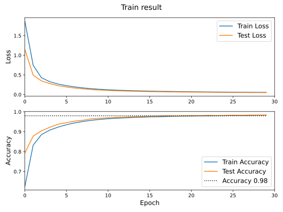
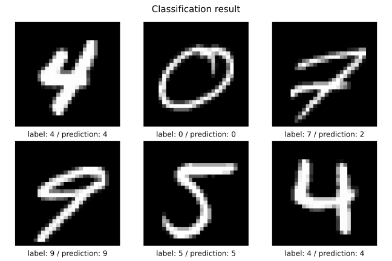

# Artitificial Neural Networks (MNIST)

## Import modules

```python
import torch
from torch import nn, optim
from torch.nn import functional as F
from torch.utils.data import DataLoader

from torchvision import datasets, transforms

from matplotlib import pyplot as plt

torch.manual_seed(0)
torch.cuda.manual_seed(0)
```

## Connect to Google Drive (in Google Colab)

```python
try:
    from google.colab import drive
    import os

    drive.mount("/gdrive")
    gdrive_root = "/gdrive/My Drive"
    data_dir = os.path.join(gdrive_root, "AI501HW5")
except:
    data_dir = "./"
```

## Set hyperparameters

```python
max_epoch = 30
learning_rate = 0.0001
batch_size = 512
test_batch_size = 1024
device = "cuda"
```

## Construct data pipeline

```python
train_dataset = datasets.MNIST(root=data_dir, train=True, download=True, transform=transforms.ToTensor())
train_loader = DataLoader(train_dataset, batch_size=batch_size, shuffle=True, pin_memory=True)

test_dataset = datasets.MNIST(root=data_dir, train=False, download=True, transform=transforms.ToTensor())
test_loader = DataLoader(test_dataset, batch_size=test_batch_size, shuffle=False, pin_memory=True)

classes = ("0","1","2","3","4","5","6","7","8","9")
```

## Define a model

```python
class Classifier(nn.Module):
    def __init__(self):
        super().__init__()

        self.conv1 = nn.Conv2d(in_channels=1, out_channels=32, kernel_size=3)
        self.relu1 = nn.ReLU()
        self.maxpool1 = nn.MaxPool2d(kernel_size=2)
        self.conv2 = nn.Conv2d(in_channels=32, out_channels=64, kernel_size=3)
        self.relu2 = nn.ReLU()
        self.maxpool2 = nn.MaxPool2d(kernel_size=2)
        self.flatten = nn.Flatten()
        self.linear = nn.Linear(in_features=1600, out_features=10)

    def forward(self, x):
        x = self.maxpool1(self.relu1(self.conv1(x)))
        x = self.maxpool2(self.relu2(self.conv2(x)))
        x = self.flatten(x)
        x = self.linear(x)
        return x
```

## Initilize the model and optimizer

```python
model = Classifier().to(device)
optimizer = optim.Adam(model.parameters(), lr=learning_rate)

print("Model Structure")
print(model)
```

> ```
> Model Structure
> Classifier(
>   (conv1): Conv2d(1, 32, kernel_size=(3, 3), stride=(1, 1))
>   (relu1): ReLU()
>   (maxpool1): MaxPool2d(kernel_size=2, stride=2, padding=0, dilation=1, ceil_mode=False)
>   (conv2): Conv2d(32, 64, kernel_size=(3, 3), stride=(1, 1))
>   (relu2): ReLU()
>   (maxpool2): MaxPool2d(kernel_size=2, stride=2, padding=0, dilation=1, ceil_mode=False)
>   (flatten): Flatten(start_dim=1, end_dim=-1)
>   (linear): Linear(in_features=1600, out_features=10, bias=True)
> )
> ```

## Define the training procedure

```python
def train(model, optimizer, train_loader):
    model.train()

    train_loss = 0
    train_corrects = 0

    for x, y in train_loader:
        inputs = x.to(device)
        labels = y.to(device)
        outputs = model(inputs)

        optimizer.zero_grad()

        loss = F.cross_entropy(outputs, labels)
        loss.backward()

        optimizer.step()

        train_loss += loss.item() * len(x)
        train_corrects += labels.eq(outputs.argmax(dim=1)).sum().item()

    train_loss /= len(train_loader.dataset)
    train_acc = train_corrects / len(train_loader.dataset)

    return train_loss, train_acc
```

## Define the testing procedure

```python
def test(model, test_loader):
    model.eval()

    test_loss = 0
    test_corrects = 0

    with torch.no_grad():
        for x, y in test_loader:
            inputs = x.to(device)
            labels = y.to(device)
            outputs = model(inputs)

            loss = F.cross_entropy(outputs, labels)

            test_loss += loss.item() * len(x)
            test_corrects += labels.eq(outputs.argmax(dim=1)).sum().item()

        test_loss /= len(test_loader.dataset)
        test_acc = test_corrects / len(test_loader.dataset)

    return test_loss, test_acc
```

## Train the model

```python
train_loss_hist = []
train_acc_hist = []
test_loss_hist = []
test_acc_hist = []

for epoch in range(max_epoch):
    print(f"[epoch {epoch:2d}] ", end="", flush=True)

    train_loss, train_acc = train(model, optimizer, train_loader)
    print(f"Train loss: {train_loss:.4f} / accuracy: {train_acc:.4f}", end=" | ", flush=True)

    test_loss, test_acc = test(model, test_loader)
    print(f"Test loss: {test_loss:.4f} / accuracy: {test_acc:.4f}", flush=True)

    train_loss_hist.append(train_loss)
    train_acc_hist.append(train_acc)
    test_loss_hist.append(test_loss)
    test_acc_hist.append(test_acc)
```

> ```
> [epoch  0] Train loss: 1.8676 / accuracy: 0.6252 | Test loss: 1.1480 / accuracy: 0.7933
> [epoch  1] Train loss: 0.7438 / accuracy: 0.8326 | Test loss: 0.4922 / accuracy: 0.8782
> [epoch  2] Train loss: 0.4280 / accuracy: 0.8859 | Test loss: 0.3473 / accuracy: 0.9049
> [epoch  3] Train loss: 0.3269 / accuracy: 0.9084 | Test loss: 0.2795 / accuracy: 0.9225
> [epoch  4] Train loss: 0.2680 / accuracy: 0.9233 | Test loss: 0.2279 / accuracy: 0.9378
> [epoch  5] Train loss: 0.2269 / accuracy: 0.9352 | Test loss: 0.1933 / accuracy: 0.9455
> [epoch  6] Train loss: 0.1948 / accuracy: 0.9445 | Test loss: 0.1660 / accuracy: 0.9533
> [epoch  7] Train loss: 0.1695 / accuracy: 0.9516 | Test loss: 0.1452 / accuracy: 0.9577
> [epoch  8] Train loss: 0.1501 / accuracy: 0.9575 | Test loss: 0.1277 / accuracy: 0.9648
> [epoch  9] Train loss: 0.1348 / accuracy: 0.9618 | Test loss: 0.1159 / accuracy: 0.9675
> [epoch 10] Train loss: 0.1225 / accuracy: 0.9654 | Test loss: 0.1058 / accuracy: 0.9697
> [epoch 11] Train loss: 0.1130 / accuracy: 0.9678 | Test loss: 0.0970 / accuracy: 0.9721
> [epoch 12] Train loss: 0.1050 / accuracy: 0.9697 | Test loss: 0.0912 / accuracy: 0.9733
> [epoch 13] Train loss: 0.0984 / accuracy: 0.9717 | Test loss: 0.0848 / accuracy: 0.9754
> [epoch 14] Train loss: 0.0928 / accuracy: 0.9730 | Test loss: 0.0807 / accuracy: 0.9762
> [epoch 15] Train loss: 0.0882 / accuracy: 0.9746 | Test loss: 0.0759 / accuracy: 0.9778
> [epoch 16] Train loss: 0.0841 / accuracy: 0.9752 | Test loss: 0.0733 / accuracy: 0.9782
> [epoch 17] Train loss: 0.0807 / accuracy: 0.9763 | Test loss: 0.0686 / accuracy: 0.9800
> [epoch 18] Train loss: 0.0776 / accuracy: 0.9776 | Test loss: 0.0677 / accuracy: 0.9792
> [epoch 19] Train loss: 0.0745 / accuracy: 0.9782 | Test loss: 0.0646 / accuracy: 0.9802
> [epoch 20] Train loss: 0.0718 / accuracy: 0.9787 | Test loss: 0.0628 / accuracy: 0.9808
> [epoch 21] Train loss: 0.0699 / accuracy: 0.9794 | Test loss: 0.0604 / accuracy: 0.9805
> [epoch 22] Train loss: 0.0674 / accuracy: 0.9799 | Test loss: 0.0598 / accuracy: 0.9820
> [epoch 23] Train loss: 0.0654 / accuracy: 0.9805 | Test loss: 0.0569 / accuracy: 0.9813
> [epoch 24] Train loss: 0.0638 / accuracy: 0.9811 | Test loss: 0.0558 / accuracy: 0.9816
> [epoch 25] Train loss: 0.0619 / accuracy: 0.9819 | Test loss: 0.0545 / accuracy: 0.9831
> [epoch 26] Train loss: 0.0604 / accuracy: 0.9820 | Test loss: 0.0539 / accuracy: 0.9826
> [epoch 27] Train loss: 0.0593 / accuracy: 0.9823 | Test loss: 0.0522 / accuracy: 0.9837
> [epoch 28] Train loss: 0.0576 / accuracy: 0.9832 | Test loss: 0.0508 / accuracy: 0.9836
> [epoch 29] Train loss: 0.0564 / accuracy: 0.9833 | Test loss: 0.0504 / accuracy: 0.9836
> ```

## Plot training result

```python
def plot_history(train_loss_hist, train_acc_hist, test_loss_hist, test_acc_hist):
    fig, axes = plt.subplots(2, 1, figsize=(8, 6))

    axes[0].set_xlim(0, len(train_loss_hist))
    axes[0].plot(range(len(train_loss_hist)), train_loss_hist, label="Train Loss")
    axes[0].plot(range(len(test_loss_hist)), test_loss_hist, label="Test Loss")
    axes[0].set_ylabel("Loss", fontsize=13)
    axes[0].legend(fontsize=13)

    axes[1].set_xlim(0, len(train_acc_hist))
    axes[1].plot(range(len(train_acc_hist)), train_acc_hist, label="Train Accuracy")
    axes[1].plot(range(len(test_acc_hist)), test_acc_hist, label="Test Accuracy")
    axes[1].plot(range(len(test_acc_hist)), [0.98] * len(test_acc_hist), "k:", label="Accuracy 0.98")
    axes[1].set_ylabel("Accuracy", fontsize=13)
    axes[1].set_xlabel("Epoch", fontsize=13)
    axes[1].legend(fontsize=13)

    fig.suptitle("Train result", fontsize=15)
    fig.tight_layout()

    return fig

plot_history(train_loss_hist, train_acc_hist, test_loss_hist, test_acc_hist).show()
```

> 

## Plot classification result

```python
model.eval()

rand_idx = torch.randint(low=0, high=len(test_loader.dataset), size=(6,))

test_inputs = torch.stack([test_dataset[idx][0] for idx in rand_idx])
test_labels = torch.tensor([test_dataset[idx][1] for idx in rand_idx])
test_predictions = model(test_inputs.to(device)).argmax(dim=1)

test_images = test_inputs.squeeze(dim=1)
```

```python
def plot_classification(images, labels, predictions, size):
    fig, axes = plt.subplots(*size, figsize=(size[1] * 3, size[0] * 3))

    for idx, (image, label, prediction) in enumerate(zip(images, labels, predictions)):
        i, j = idx // size[1], idx % size[1]
        axes[i, j].imshow(image, cmap="gray")
        axes[i, j].set_title(f"label: {label} / prediction: {prediction}", y=-0.13)
        axes[i, j].axis("off")

    fig.suptitle("Classification result", fontsize=15)
    fig.tight_layout()

    return fig

plot_classification(test_images, test_labels, test_predictions, size=(2, 3)).show()
```

> 

## Discussion and Analysis

I used following structure to build CNN architecture for the MNIST classification.

| Layer       | Parameter                                  |
| ----------- | ------------------------------------------ |
| Convolution | Channels = 32,  Kernel = 3 x 3, Stride = 1 |
| Activation  | Function = ReLU                            |
| Pooling     | Function = Max, Kernel = 2 x 2, Stride = 2 |
| Convolution | Channels = 64,  Kernel = 3 x 3, Stride = 1 |
| Activation  | Function = ReLU                            |
| Pooling     | Function = Max, Kernel = 2 x 2, Stride = 2 |
| Flatten     | -                                          |
| Linear      | Nodes = 10                                 |

In this architecture, two sets of convolution layers act as feature extractor and the last linear layer acts as linear classifier.
I used two max-pooling layers to reduce the number of parameters of the model which prevent overfitting.
I set the learning rate 0.0001, the batch size 512, and ran 30 epochs to adjust a training time and a performance of the model.
Also, I introduced a different batch size 1024 for the test batch to reduce a testing time.
As shown in the train result plot above, both the train loss and the test loss steadily decreased and reached a certain level. And the test accuracy reached the accuracy of 0.98 as intended. It means the algorithm properly converged, and did not overfitted or underfitted.
